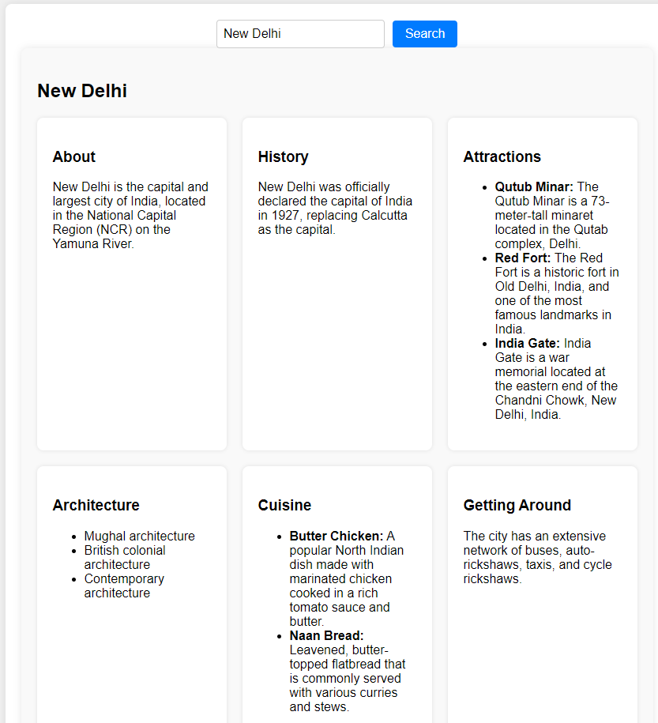

# AI Tour Guide

Welcome to AI Tour Guide! This application leverages the power of Language Learning Models (LLM) to provide an interactive tour guide experience. 

## Getting Started

These instructions will get you a copy of the project up and running on your local machine for development and testing purposes.

### Prerequisites

Before you begin, ensure you have met the following requirements:

- You have installed the latest version of [Node.js and npm](https://nodejs.org/en/download/)
- You have Java 17 and above installed on your machine.
- You have read the [article](https://medium.com/@beyondbasics/how-to-install-an-llm-model-locally-a-comprehensive-guide-08e3ba015aca) on how to install an LLM model locally.

### Installing AI Tour Guide

To install AI Tour Guide, follow these steps:

1. Clone the repo:
   ```bash
      git clone https://github.com/your/repo.git
2. Run LLM locally:
   ```bash
      Follow the instructions from the article linked in the prerequisites
4. Run the backend:
   ```bash
      cd ai-tour-guide/backend/
      ./mvnw spring-boot:run
5. Run the frontend:
   ```bash
      cd ai-tour-guide/frontend/
      npm install
      npm start


### Usage
Enter the city name in UI and wait for the response

